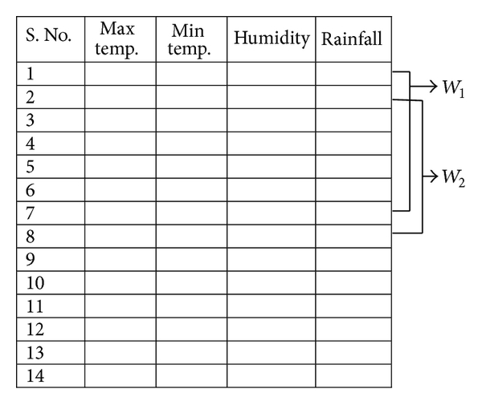
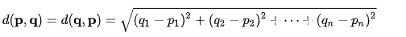
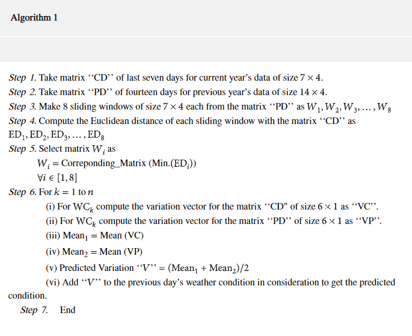
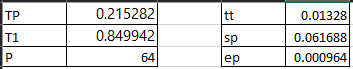

# Paralelismo en la predicción de lluvias en subregiones del Sahara: clusterización y comunicación.

### Introducción
El presente trabajo busca predecir el cambio climático en ciertas regiones del Sahara, dado que los cultivos de estas dependen de las lluias que hay. Sin embargo, dadas las limitaciones de encontrar un dataset que cumpla con los requerimientos básicos para el modelo estadístico propuesto, nos vimos en la obligación de usar otro dataset, en este caso el clima en Washington D.C.

### Análisis del problema
Existen múltiples acercamientos a la problemática del clima dentro de la computación, especialmente por las potenciales variaciones del clima y los diversos factores implicados, que pueden volver predicciones fuera de un rango de 10 días, Inutilizables. Por lo anterior, es común encontrar implementaciones que utilizan lógica difusa [5], Redes neuronales [4] con múltiples componentes que aumentan su complejidad, y modelos estadísticos [2] que aunque complejos, pueden omitir aspectos a considerar dependiendo del nivel de abstracción utilizado en el modelo.

En este caso, se implementará una solución que haga uso de un modelo estadístico que considere las condiciones climáticas de la semana anterior, además de las de las 2 semanas anteriores, a través de un algoritmo de ventana deslizante, que permitirá determinar las fechas que más se acerquen al comportamiento de los componentes del clima a analizar de la semana actual.

Las fechas más cercanas pueden encontrarse a través de una diferencia euclidiana entre los componentes a considerar dentro del modelo determinado. 

Al encontrar este valor, se puede determinar cuál matriz dentro de las ventanas, tiene el mayor acercamiento a la matriz actual, que denominaremos CD. 

Al obtener estos componentes, se puede ejecutar una diferencia simple para determinar la relación entre la semana anterior y la actual. Al tener valores que pueden ser cero, ejecutar una diferencia porcentual no es posible. Después de esto se requiere encontrar una media para cada componente de las semanas y entre ellas para así encontrar la asociación entre la semana anterior y la actual. Este dato podrá asociarse al día anterior al solicitado, para generar así la predicción. El algoritmo puede definirse de la siguiente manera:

 

A través de este proceso se encuentra una aproximación de los componentes a analizar en este caso. Por motivos de facilidad, se tomaron los datos de National Oceanic and Atmospheric Administration (NOAA), para la ciudad de Washington en su estación GHCND:USC00450008, utilizando un rango de fechas desde el 12/05/2013 hasta 12/05/2020, fecha en la que se cierra dicha estación.

### Algoritmo Secuencial
Es importante resaltar que el algoritmo secuencial expresado anteriormente fue tomado del paper Weather Forecasting Using Sliding Window Algorithm, referenciado en la parte inferior del algoritmo. Sin embargo, su implementación fue desarrollada por los estudiantes que presentan este trabajo.

Para la implementación secuencial de este algoritmo se utilizó el lenguaje C++, creando 2 clases: Main y Prediction. En la clase Main se encuentra la estructura general del algoritmo, con la lectura de datos y su almacenamiento en vectores. A través del método main, se llaman los métodos de la clase Prediction, que ejecutan funciones como la distancia euclidiana, entre otras. 

Cada función hace uso de vectores para obtener los datos requeridos para este proceso, y se retornan resultados de la misma manera. Pensando en el futuro de la implementación paralela, se reemplazaron las instancias en las cuales una función requería valores de la iteración anterior, utilizando un equivalente a través de la semana siguiente. Por ejemplo, para encontrar la diferencia entre un componente actual y el anterior, se encuentra la diferencia entre uno actual y el componente futuro, evitando así la incertidumbre que podría causar errores al paralelizar el código.

Para probar este algoritmo se utilizan 3 meses de fechas, desde el primero de enero de 2020 hasta el final del mes de marzo, almacenadas en el csv llamado sample. Una vez se obtienen estos resultados, se toma el tiempo de ejecución de este algoritmo.

Cabe resaltar que este tiempo puede variar dependiendo de la cantidad de tareas ejecutándose en la máquina actualmente. Si es un equipo personal, se pueden encontrar variaciones al hacer streaming de la pantalla, entre otras tareas que demanden recursos.

### Algoritmo Paralelo (PCAM)
Para el algoritmo paralelo se hace uso exclusivo de OpenMP para las funciones de la clase Prediction, en este caso a través de estos métodos, se encuentra el ciclo óptimo a paralelizar y se ejecuta el proceso, aclarando en los puntos necesarios las tareas sincrónicas que se deben ejecutar a través de Mutex. En el repositorio se puede evidenciar el proceso de este código.

Una vez se genera el ejecutable optimizado y sus respectivos reportes para cada clase, debe admitirse como un trabajo dentro de cloudfax. Esto puede presentar errores si solamente se provee el ejecutable generado. Para facilitar el proceso de ejecución se creó un archivo appjob que permite añadir con facilidad a la cola la tarea a ejecutar.

Cuando se ejecuta el código se evidencia una mejora en tiempo de ejecución comparado con los 3 segundos expresados anteriormente. esto puede observarse en el archivo appjob.o<id del job>.

a. Particionamiento
Los datos a analizar se segmentan en cada una de las funciones a través de los procesos como el Sliding window ejecutado. Para este proceso cada uno de los métodos que usa vectores fue vectorizado y hace uso de OpenMP en cada for ejecutado. Esto puede observarse especialmente en el archivo prediction.cc.

b. Comunicación
La comunicación entre procesos ejecutados la realiza OpenMP de forma transparente haciendo uso de hilos. Dado que todos los datos se encuentran en memoria compartida, se puede acceder con facilidad a los datos, a menos que se requiera un proceso de escritura pues en estos casos se ejecuta un Mutex para garantizar una gestión sincrónica de los datos. En este caso no fue posible finalizar la implementación haciendo uso de MPI para el paso de mensajes.

c. Aglomeración
La aglomeración de datos es realizada a través de matrices después del proceso de Sliding window. En este, gracias a los vectores, contamos con varias matrices resultantes de las Sliding windows y tenemos que empezar a computar las predicciones. Este proceso se hace cuando encontramos la distancia euclideana, la varianza, la media varianza y la aproximación.

d. Mapping  
Dado que solo hacemos uso de OpemMP y no usamos OpenMPI, el mapping lo maneja OpenMP y esto se puede ver evidenciado en el reporte de salida ipo_out.optrpt.

### Desarrollo
Para iniciar (sea en la carpeta del algoritmo secuencial o paralelo) debemos hacer el comando make, así generamos los reportes de salida. Luego debemos hacer el comando qsub appjob, esto pondrá nuestro proceso en cola. Para finalizar podemos ver nuestros resultado en el archivo appjob.o<id del job> y comprobamos los resultados.

### Evidencia Performance
Evidenciamos la diferenca de ejecución entre ambos algoritmos con la siguiente imagen:

### Observación
A pesar de que el repositorio muestra que mayormente los commits fueron hechos por jricaur1 vale la pena aclarar que el código fue trabajado haciendo uso de la extensión liveshare de Visual Studio Code, en el cual ambos integrantes del equipo participamos.

### Referencias
https://www.worldcommunitygrid.org/discover.action

https://www.worldscientific.com/doi/abs/10.1142/S0129053393000049

https://doi.org/10.1155/2020/814837

https://www.mpi-forum.org/ 

https://www.openmp.org/ 

https://scijinks.gov/forecast-reliability/#:~:text=A%20seven%2Dday%20forecast%20can,90%20percent%20of%20the%20time.&text=Since%20we%20can't%20collect,assumptions%20to%20predict%20future%20weather

https://www.ncdc.noaa.gov/ 

https://www.hindawi.com/journals/isrn/2013/156540/

https://ieeexplore.ieee.org/abstract/document/1384579

https://www.researchgate.net/profile/Zuraidi_Saad/publication/221258399_Weather_Forecasting_Using_Photovoltaic_System_and_Neural_Network/links/57037ea608aea09bb1a3d96d/Weather-Forecasting-Using-Photovoltaic-System-and-Neural-Network.pdf

https://www.sciencedirect.com/science/article/abs/pii/0165011488901236
